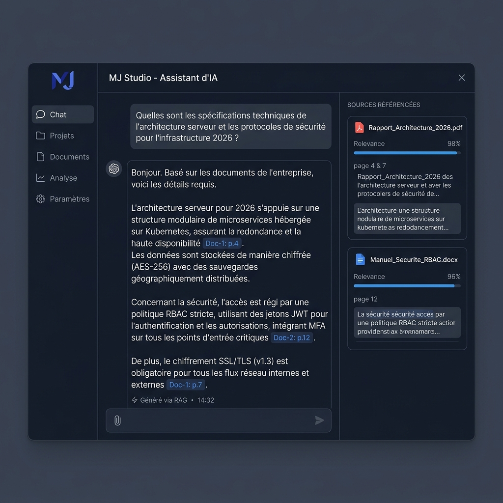

# MJ Studio — Intelligence Documentaire RAG d'Entreprise

[](https://opensource.org/licenses/MIT)
[](https://github.com/mohamedjerbi2506)
[](https://www.enicarthage.rnu.tn/)

> **Knowledge. Retrieved. Answered.**  
> Application d'intelligence documentaire d'entreprise basée sur l'architecture **Retrieval-Augmented Generation (RAG)** avec réponses synthétisées, citations vérifiables, recherche sémantique hybride et contrôle d'accès RBAC.



---

## ✨ Fonctionnalités Principales

| Fonctionnalité | Description | Statut |
|---|---|---|
| 🌐 **Page d'Accueil Publique** | Showcase professionnelle avec démo visuelle et navigation fluide | ✅ |
| 📁 **Ingestion Multi-Formats** | Extraction synchrone PDF, Word (.docx), Excel (.xlsx), Textes et Markdown | ✅ |
| 🔍 **Recherche Sémantique Hybride** | Vector Search (COSINE) + BM25 Keyword Search + Cohere Rerank v3.0 | ✅ |
| 📎 **Citations Sourcées In-Line** | Badges cliquables `[Doc: p.X]` liant directement au panneau d'extraits sources | ✅ |
| 🔐 **Sécurité & RBAC (4 Niveaux)** | Rôles Administrateur, Éditeur, Auditeur et Lecteur avec authentification 2FA/TOTP | ✅ |
| 📊 **Tableau de Bord Administrateur**| Métriques de performance, volumétrie des requêtes et répartition par format | ✅ |
| 📜 **Journal d'Audit Immuable** | Journalisation complète de toutes les requêtes et actions avec export CSV | ✅ |
| 🌙 **Thème Clair/Sombre Persistant**| Thème clair WCAG AA haute lisibilité + thème sombre, zéro clignotement au chargement | ✅ |
| 🔄 **Mode Mock Intégral** | Exécution locale complète sans dépendance cloud obligatoire | ✅ |

---

## 🛠️ Stack Technique

- **Frontend** : React 18 · Vite · TypeScript · Tailwind CSS · Framer Motion · Lucide Icons
- **Backend** : Express.js · Node.js · TypeScript · Server-Sent Events (SSE)
- **RAG & Vector Database** : Supabase Vector (pgvector) · Cohere Rerank v3.0 · BM25 Keyword Search
- **Parsing Documentaire** : PDFParse · Mammoth (.docx) · XLSX · Tesseract OCR
- **Sécurité** : JWT · Bcrypt · TOTP/2FA (RFC 6238) · Rate Limiting · Prompt Injection Filter

---

## 🚀 Guide de Démarrage Rapide

### 1. Prérequis
- **Node.js** (v18.0 ou supérieur)
- **npm** (v9.0 ou supérieur) ou **yarn** / **pnpm**

### 2. Installation Pas à Pas

```bash
# 1. Cloner le dépôt
git clone https://github.com/mohamedjerbi2506/rag-bedrock-opensearch.git
cd rag-bedrock-opensearch

# 2. Installer les dépendances du Backend
cd backend
npm install

# 3. Installer les dépendances du Frontend
cd ../frontend
npm install
```

### 3. Configuration des Variables d'Environnement

```bash
# Copier les fichiers d'exemple
cp backend/.env.example backend/.env
cp frontend/.env.example frontend/.env.local
```

### 4. Lancement en Mode Développement

Dans deux terminaux séparés :

```bash
# Terminal 1 — Lancer le Backend REST API (Port 3001)
cd backend
npm run dev

# Terminal 2 — Lancer le Frontend Vite (Port 5173)
cd frontend
npm run dev
```

Ouvrez votre navigateur sur **`http://localhost:5173`**.

---

## 🔐 Comptes de Démonstration

| Email | Mot de passe | Rôle | Accès |
|---|---|---|---|
| `admin@smartdocs.com` | `admin123` | Administrateur | Tout (Chat, Documents, Dashboard, Audit) |
| `editor@smartdocs.com` | `admin123` | Éditeur | Chat + Gestion des Documents |
| `auditor@smartdocs.com` | `admin123` | Auditeur | Chat + Journal d'Audit |
| `user@smartdocs.com` | `admin123` | Lecteur | Chat uniquement |

---

## 🏗️ Structure des Dossiers

```text
rag-bedrock-opensearch/
├── .github/
│   └── workflows/
│       └── ci.yml                 # Automation GitHub Actions (Lint + Build)
├── backend/                        # Serveur REST API Express.js
│   ├── data/                      # Stockage des utilisateurs locaux et démos
│   ├── src/
│   │   ├── local/server.ts        # Point d'entrée serveur HTTP/SSE
│   │   ├── middleware/            # Sécurité, JWT, RBAC & Anti-injection
│   │   ├── mocks/                 # Moteurs d'embeddings et de réponse simulés
│   │   └── services/              # Supabase, Cohere Rerank, Audit, TOTP
│   └── package.json
├── frontend/                       # Application Single Page React 18 + Vite
│   ├── public/
│   │   └── app-preview.png        # Capture d'écran officielle de l'application
│   ├── src/
│   │   ├── api/                   # Client HTTP REST & streaming SSE
│   │   ├── auth/                  # Context d'authentification
│   │   ├── components/            # Layout, Navigation, ThemeToggle, Skeletons
│   │   ├── pages/                 # LandingPage, ChatPage, DocumentsPage, AdminPage...
│   │   └── index.css              # Tokens de design sémantiques WCAG AA
│   └── package.json
├── ARCHITECTURE.md                 # Schéma et description du pipeline RAG
├── LICENSE                         # Licence MIT
└── README.md                       # Documentation du projet
```

---

## 👨‍💻 Auteur & Cadre Académique

Projet élaboré et réalisé par :

**Mohamed Jerbi — MJ Studio**  
*Élève Ingénieur — École Nationale d'Ingénieurs de Carthage (ENI Carthage)*  
- GitHub : [@mohamedjerbi2506](https://github.com/mohamedjerbi2506)  
- Email : `mohamed.jerbi@enicar.ucar.tn`

---

## 📜 Licence

Ce projet est sous licence **MIT**. Voir le fichier [LICENSE](LICENSE) pour plus de détails.
