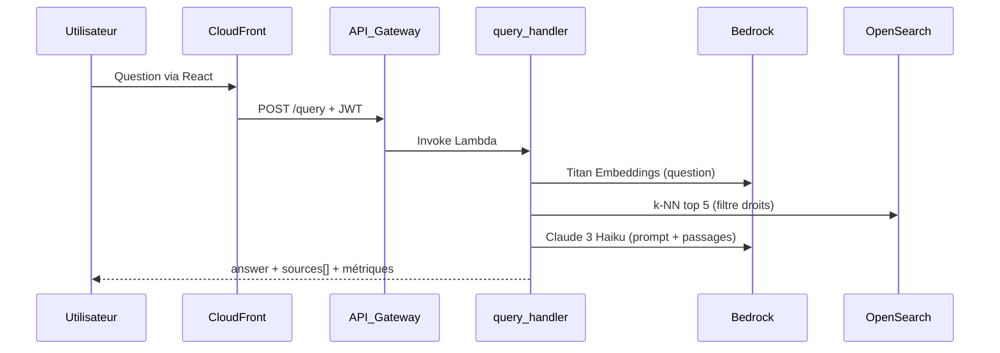
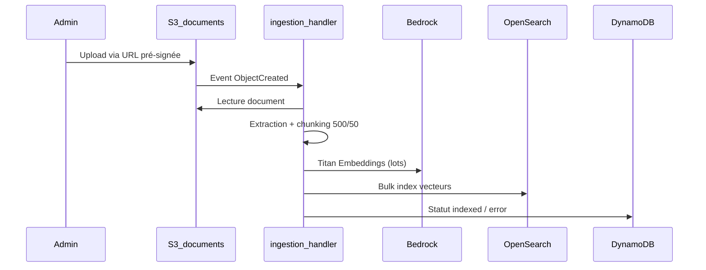

# Architecture

## Flux de lecture (query)

## Flux d'écriture (ingestion)

## Composants Terraform

| Module | Ressources principales |
|--------|------------------------|
| network | VPC endpoints (optionnel dev) |
| auth | Cognito User Pool, groupes user/admin |
| storage | S3 KMS, DynamoDB documents, SSM |
| search | OpenSearch Serverless collection + index k-NN |
| api | API Gateway, Lambdas, IAM |
| frontend | S3 site statique, CloudFront |
