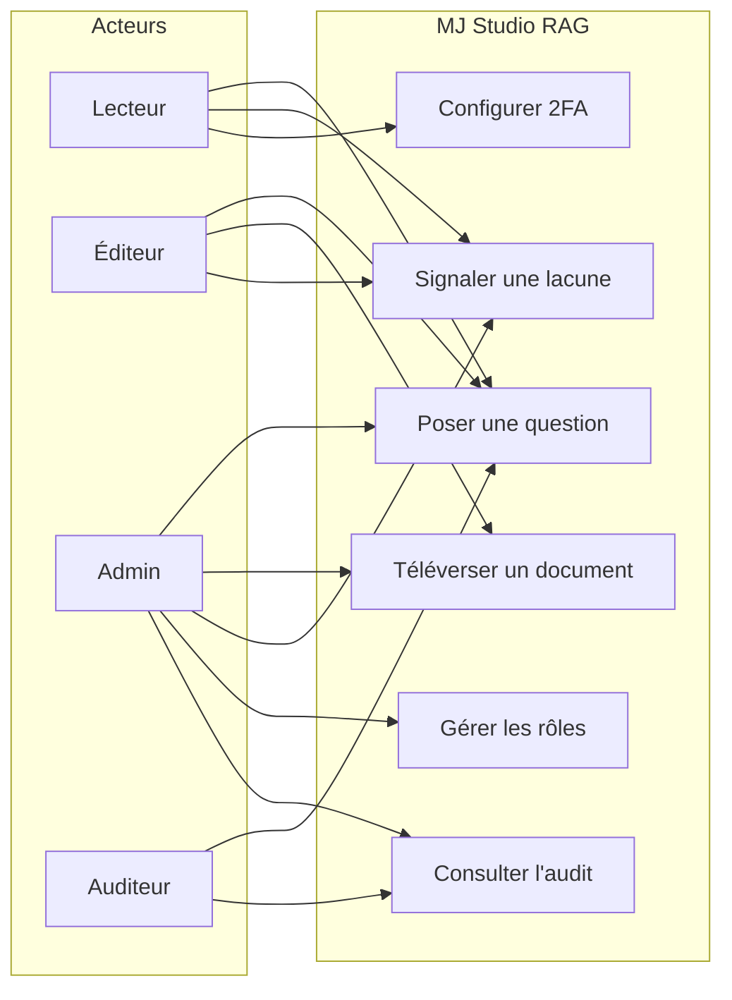
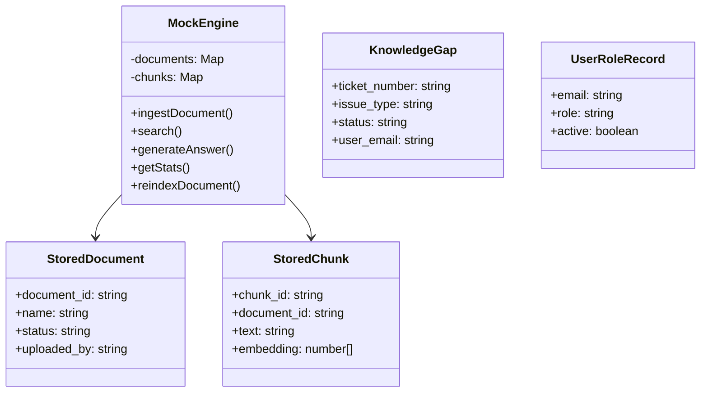
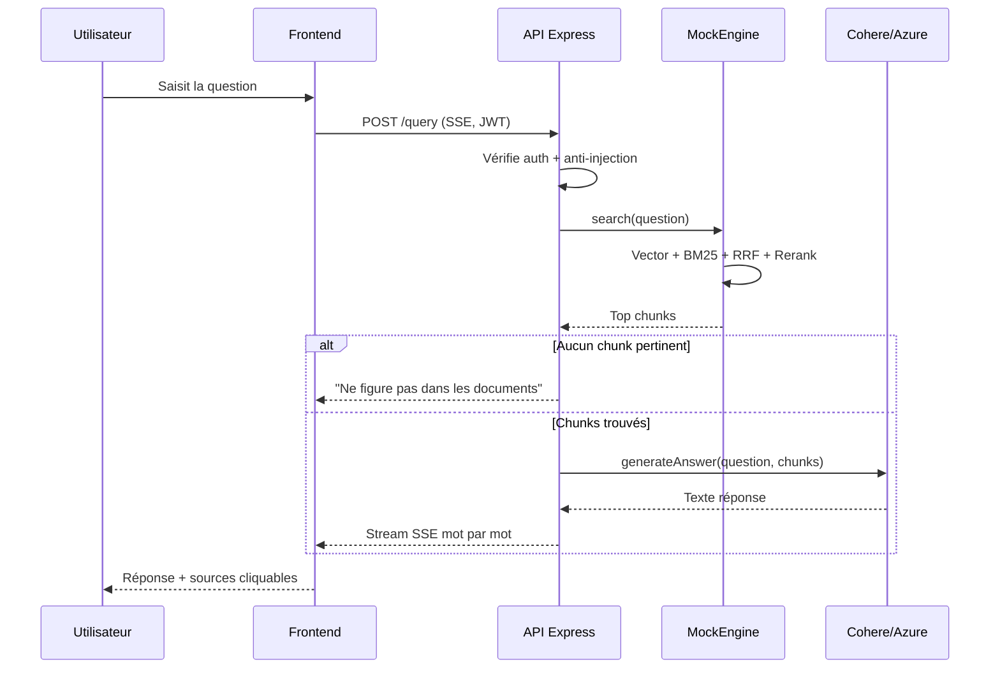
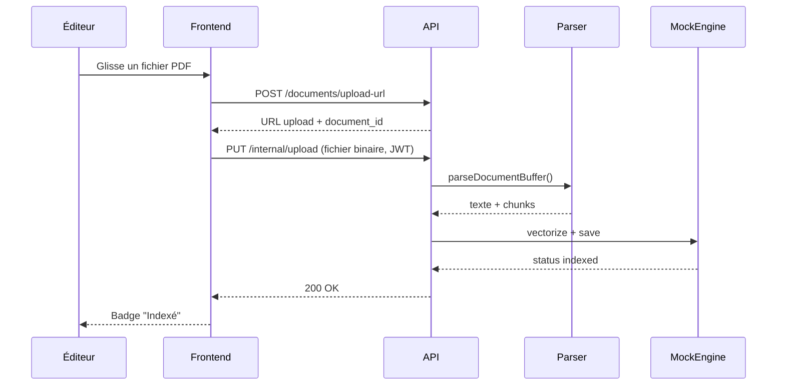
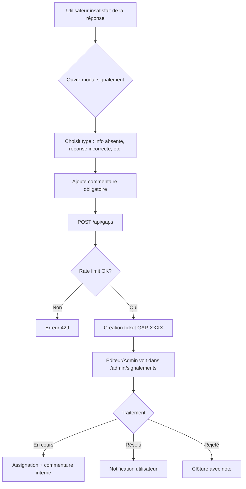
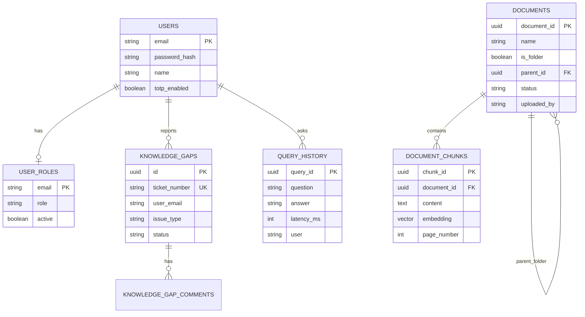
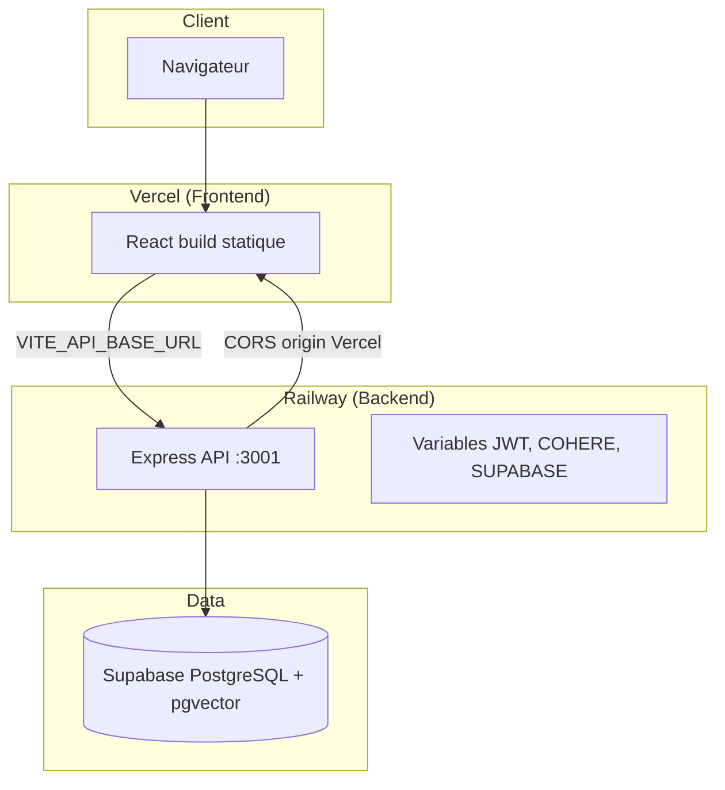

# Description complète du projet — MJ Studio RAG

> **Auteur :** Mohamed Jerbi — ENI Carthage × Smartovate  
> **Type :** Application RAG (Retrieval-Augmented Generation) — l'IA cherche d'abord dans les documents, puis répond avec des sources.

---

## 1. Présentation générale

### Quel problème ?

Dans une entreprise, l'information est éparpillée : PDF de procédures, fichiers Word RH, tableaux Excel, notes internes. Les employés perdent du temps à chercher. Une IA classique (ChatGPT seul) invente parfois des réponses.

**MJ Studio RAG** résout ce problème : l'utilisateur pose une question en français, le système cherche dans **ses** documents d'entreprise, puis génère une réponse **avec des citations cliquables** vers les passages sources.

### Pour qui ?

| Acteur | Besoin |
|--------|--------|
| **Employé (lecteur)** | Poser des questions, obtenir des réponses fiables |
| **Éditeur documentaire** | Téléverser et organiser les documents |
| **Administrateur** | Stats, gestion des comptes, vue globale |
| **Auditeur** | Tracer qui a fait quoi (sécurité, conformité) |

---

## 2. Objectifs

### Objectif principal

Construire une application web d'intelligence documentaire : upload multi-formats → indexation → chat avec citations vérifiables.

### Objectifs secondaires

- Contrôle d'accès par rôles (RBAC)
- Signalement des lacunes documentaires (tickets)
- Journal d'audit exportable
- Mode local sans cloud obligatoire (démo / stage)
- Interface moderne, thème clair/sombre, responsive

---

## 3. Fonctionnalités par rôle

### Lecteur (reader)

- Se connecter / s'inscrire
- Chat RAG avec historique local
- Voir les sources cliquables
- Signaler une lacune documentaire
- Gérer son profil et activer la 2FA

### Éditeur (editor)

- Tout ce que fait le lecteur
- Téléverser PDF, Word, Excel, Markdown, TXT
- Créer des dossiers, renommer, supprimer
- Gérer les signalements reçus (statut, commentaires)

### Auditeur (auditor)

- Chat RAG
- Consulter le journal d'audit (requêtes + sécurité)
- Exporter en CSV

### Administrateur (admin)

- Tout ce que font éditeur + auditeur
- Dashboard : documents, requêtes, latence, formats
- Promouvoir / rétrograder / suspendre des utilisateurs
- Supprimer des signalements

---

## 4. Architecture

### Flux global

```
Navigateur (React)
    │  HTTPS / REST + SSE
    ▼
API Express (Node.js)
    │  parse, chunk, embed
    ▼
Stockage (JSON local OU Supabase pgvector)
    │  recherche hybride
    ▼
Modèle IA (Cohere / Azure OpenAI — ou fallback local)
    │
    ▼
Réponse streamée + sources
```

### Composants principaux

| Couche | Technologie | Rôle |
|--------|-------------|------|
| Frontend | React 18 + Vite + Tailwind | Interface utilisateur |
| API | Express 5 + TypeScript | Auth, documents, query SSE |
| Moteur RAG | `MockEngine` | Chunking, RRF, rerank, génération |
| Persistance | Fichiers JSON / Supabase | Documents, chunks, users, audit |
| IA | Cohere, Azure OpenAI | Embeddings + chat (optionnel) |

---

## 5. Conception — Diagrammes

### 5.1 Diagramme de cas d'utilisation



**Explication :** Le lecteur interroge la base et peut signaler un problème. L'éditeur ajoute des documents. L'admin gère les comptes. L'auditeur lit les logs sans modifier les documents.

---

### 5.2 Diagramme de classes (simplifié)



**Explication :** `MockEngine` est le cœur métier. Chaque document produit plusieurs chunks vectorisés. Les lacunes et rôles sont gérés à part.

---

### 5.3 Séquence — Poser une question et recevoir la réponse



**Explication :** La question passe par la recherche avant l'IA. Si rien n'est trouvé, on ne laisse pas l'IA inventer. Sinon, la réponse est streamée avec les sources.

---

### 5.4 Séquence — Téléverser et indexer un document



**Explication :** L'upload est en deux temps (URL puis PUT). Le parser extrait le vrai texte. Le moteur découpe et vectorise avant de marquer le document comme indexé.

---

### 5.5 Activité — Signalement de lacune documentaire



**Explication :** L'utilisateur crée un ticket depuis le chat. L'éditeur le traite. Si résolu, l'utilisateur est notifié via `/api/notifications/my-resolutions`.

---

### 5.6 Schéma base de données (entités et relations)



**Explication :** En mode local, ces entités sont des fichiers JSON. Avec Supabase, ce sont des tables PostgreSQL avec pgvector pour les embeddings.

---

### 5.7 Déploiement (cible Vercel + Railway)



**Explication :** Le frontend est servi par Vercel. L'API tourne sur Railway. Supabase stocke documents et vecteurs. CORS lie les deux domaines.

> **État actuel :** Terraform AWS et mode JSON local existent ; Vercel/Railway à configurer (voir étape 4.3).

---

## 6. Choix techniques

| Choix | Pourquoi |
|-------|----------|
| **React + Vite** | Rapide à développer, hot reload, build léger |
| **Express** | Simple pour REST + SSE streaming |
| **JSON local** | Démo stage sans compte cloud |
| **Supabase optionnel** | pgvector intégré si passage prod |
| **Cohere / Azure** | Bon français, rerank multilingue |
| **RRF + BM25 + vectoriel** | Meilleure précision que vectoriel seul |
| **JWT + bcrypt** | Auth standard, facile à comprendre |
| **Tailwind** | UI cohérente, thème clair/sombre |

---

## 7. Sécurité

| Mesure | Détail |
|--------|--------|
| Auth JWT | Token Bearer sur routes privées |
| RBAC 4 rôles | Guards frontend + `requireRoles` backend |
| 2FA TOTP | RFC 6238, optionnelle par compte |
| Rate limiting | 10 auth/min, 120 API/min |
| Anti-injection prompt | Regex sur `/query` |
| Headers sécurité | X-Frame-Options, nosniff, etc. |
| Upload protégé | Auth + whitelist extensions + 20 Mo max |
| Audit immuable | JSON append-only + export CSV |

**Mesures ajoutées en finalisation :** reset mot de passe (token 1h), isolation documents par utilisateur, suppression comptes, CORS configurable, upload authentifié.

**Points à faire en production :** brancher SMTP pour reset MDP ; changer `JWT_SECRET` ; déployer Vercel/Railway.

---

## 8. Difficultés rencontrées et solutions

1. **Extraction PDF hétérogène** — Certains PDF ne donnent que peu de texte (scan). *Solution :* unpdf page par page + message d'erreur clair si < 50 caractères.

2. **Latence IA cloud** — Cohere/Azure parfois lent ou sans crédits. *Solution :* fallback affichant les extraits bruts + mode mock local.

3. **Cohérence des rôles** — JWT vs fichier `user_roles.json`. *Solution :* le middleware relit toujours `roleStore` à chaque requête.

4. **Streaming SSE** — Buffering nginx/proxy. *Solution :* headers `Cache-Control: no-cache`, flush par mot.

5. **Upload gros fichiers** — Timeout mémoire. *Solution :* limite 20 Mo, body raw Express, progression XHR côté frontend.

6. **Signalements spam** — *Solution :* rate limit 5 tickets/heure/utilisateur + validation Zod.

---

## 9. Limites actuelles et améliorations futures

| Limite | Amélioration possible |
|--------|----------------------|
| Pas de reset mot de passe | Email SMTP + token temporaire |
| Documents partagés (pas multi-tenant) | Colonne `owner_id` + filtres API |
| OCR absent | Brancher Tesseract sur PDF scannés |
| Bedrock/OpenSearch Lambda non utilisés en local | Unifier handlers AWS et Express |
| Pas de déploiement Vercel/Railway | CI/CD + guides étape 4.3 |
| Réindexation sans fichier source | Stocker binaire S3 ou re-parse |
| Tests auto limités | Suite Jest/Vitest + e2e Playwright |

---

*Document pour le chapitre 4 (conception) du rapport de stage ENI Carthage.*
